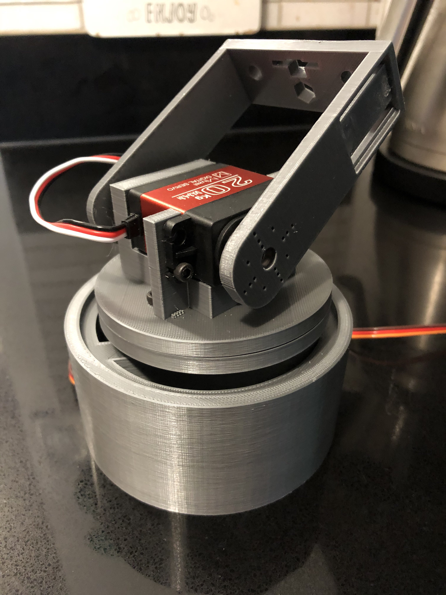

# tiltbase
Simple pan and tilt system for antenna/cameras, plan to support multiple attachments

This is a DIY pan tilt system I built for the nyan-sat challenge. Very much a prototype so there may be rough edges.

Base is propped up on a single servo, so would only suggest for lighter weight applications (antenna/pi camera), ie. don't hang your DSLR on it.

The servo insets were built for: DS3218 servos and the metal arms they come with, most other servos have smaller arms, but you should be able to screw them in to secure them (I had another set of servos in this one previously).

